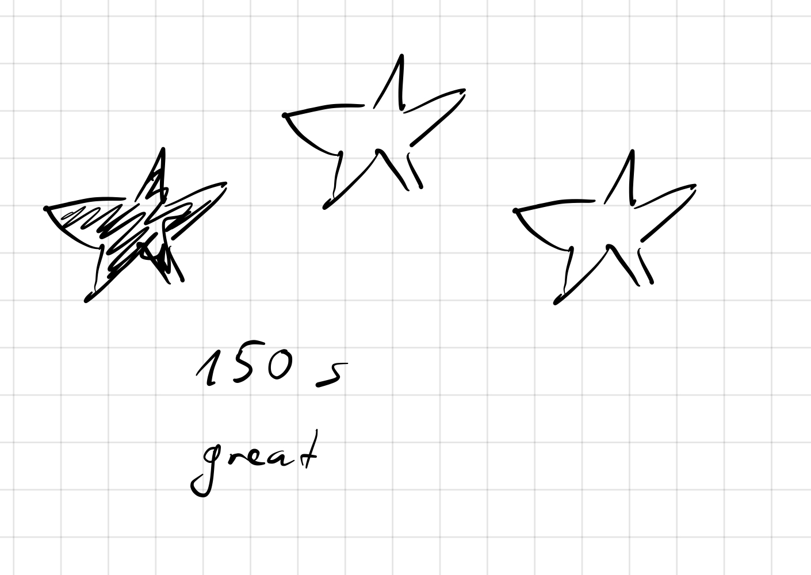

# ToDos

### Main Features

- [x] Create base scene
- [x] Implement basket
  - [X] Mouse movement
- [x] Implement stars
  - [X] Vertical movement
  - [X] Random spawning
- [x] Collision detection
  - [x] Score counting
- [x] Mountains
  - [x] With sinus-curves
- [x] Gras
- [x] Clouds
  - [x] horizontal movement
  - [x] Random spawning
- [x] Music and Sounds
  - [x] Call sounds on collision
- [x] Bombs
  - [x] Negative points OR life deduction
- [x] Define Win / Lose conditions
  - [x] Ideas: 
    - [x] Timer => Max Points
    - [x] Bomb
  - [x] reduces a life
  - [x] directly game over or lose two lifes
  - [x] You start with 5 lifes
  - [x] If you miss a star => lose a life
  - [x] Game Mechanics
    - [x] Start with fewer stars, then increase
    - [x] Start with slower speed, then increase
    - [x] Start with no clouds, add more and more clouds, maybe decrease transparency
- [x] When game ends:
  - [x] Show large score
  - [x] Stop music, instead play end sound


### Optional Features

- [x] Countdown timer => changed to regular timer
- [ ] Various Levels

  - [ ] New colors of mountains
  - [ ] New music per Level (increasing intensity)
- [x] Music: 

  - [x] Also gets faster the longer you play
  - [x] Each time you lose a life: speed increase of 20% => changed to speed increase after every 20 seconds
    - [x] either realtime calculation
    - [ ] OR: pre-calculated (if performance is an issue)
- [ ] Special items:

  - [ ] Leaves
  - [ ] Snowflakes
  - [x] Power-up? => e.g., additional life
- [x] Animate mountains


### Game Proposal Version 2:


#### Problem of Version 1

You can nearly not loose the game, since you can evade the bomb very easily.


#### Proposed Solution

- Keep bomb

- Each time, you miss a star (meaning: star reaches the bottom of the screen and gets deleted from the scene):

  - reduce a life

  - play a sound

  - Graphical change, slightly change the background-color (more reddish)

- Add a Power-Up, which gives additional life
  - add life
  - play a sound
  - slightly change background-color (less reddish)
- Increase game-speed during set time intervals (e.g. every 30 seconds):
  - link game speed with the music speed


#### ToDos for Version:

- [X]  Change some core game logic parts
- [X]  Create graphic-asset for life power-up
- [x]  Find/Create sound-asset for life power-up
- [x] Define and tweak the difficulty parameters of the game:
  - [x]  Target game duration: 1 to 5 minutes?
  - [x]  => set time-interval for game speed increase
  - [x]  => set starting game speed
- [x] Create a simple End Screen
  - [X] 1 to 3 stars:
    
      - [x]  Show reached time
  - [x]  Maybe show "No star!" / "Yeah, ok!" / "Great score!" / "Awesome, 3 stars!!", depending on reached stars
  - [x]  incl. Winning/Loosing sound => load asynchronously
- [x] Write README.md / Documentation


## Optional for Version 2:

- [ ] Show high-score-list and save newest score to disk

  - [ ] Ask for player-name

  - [ ] Show score list:

    ```
     1. Stär   268s
         ..
         ..
     2. John   162s
     3. Anne   160s
     4. ME     142s     // fat font or colored or...
     5. Sister 131s
    ```

- [x] MAYBE: Each reached star: blend in after 1s and play a sound (bling-sound, each one higher than the previous one)
